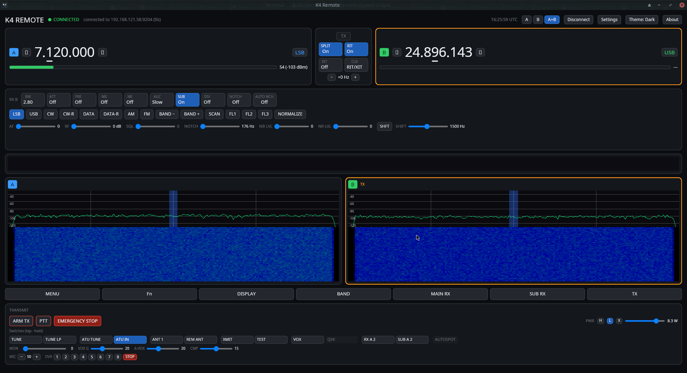
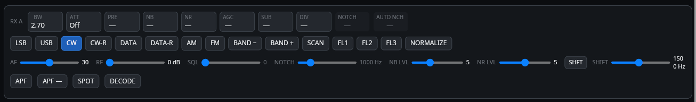
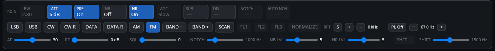
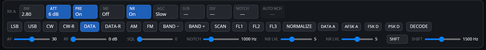

# K4 Remote

A cross-platform **remote control panel for the Elecraft K4** transceiver, written in Rust with
an [iced](https://iced.rs) GUI: rig control, metering, spectrum + waterfall, full-duplex audio,
and transmit (voice + CW) — over Ethernet or USB/serial.

It is developed **requirements-first and test-driven**, with strict traceability from
stakeholder needs down to individual tests, enforced by a build gate.



> **Status:** v0.10.0 — feature-complete; hardware bring-up in progress.
> 508 hardware-free tests pass · clippy/fmt clean · traceability gate green · CI green on Linux/macOS/Windows.
> VFO tuning, RIT/XIT, split, band, panadapter click-to-QSY, and the K-Pod (incl. F1–F8 tap/hold macros)
> are validated against a real K4; audio / PTT / waterfall rendering / serial bring-up is ongoing.
> 0.4.0 closed **four transmit-safety faults** found on a live K4 — most seriously, the transmitter
> could be keyed with the TX arm off. See [CHANGELOG.md](CHANGELOG.md); anyone on 0.3.0 should update.
>
> **In 0.2.x:** Elecraft K-Pod support (rocker + encoder tuning, and configurable F1–F8 tap/hold
> macros), a filterable + selectable diagnostics console, and RIT/XIT sync fixes; K-Pod tap/hold
> discrimination and hold-while-tuning fixes (0.2.1); a **Windows `setup.exe` installer** (0.2.2);
> band buttons following the transmit VFO and **in-app MENU value editing** (0.2.3).
>
> **In 0.3.0:** a **mode-aware panadapter** — click-to-QSY that places the passband by sideband
> sense, a waterfall that scrolls with the VFO, and labelled frequency/level scales synced to the
> radio — plus **ATU and TUNE control**, an About-box **update check**, and **switchable control
> tooltips**.
>
> **New in 0.10.0:** **spot nameplates on the spectrum** — callsigns from the **Reverse Beacon
> Network**, **DX clusters**, **PSK Reporter** (optionally over TLS), **POTA** and **FreeDV Reporter**
> (optionally over wss), drawn at their frequency, coloured by source and fading with age; click one to
> tune to it. Plus **KPA1500 amplifier support**, a smoother **GPU-drawn spectrum and waterfall** with
> lower GPU load, a **spectrum afterglow**, **Settings in its own tabbed window**, and larger spectrum text.
>
> **New in 0.9.0:** an **automatic update check** — the app looks for a newer release once at
> start-up and shows a clickable link in the top bar if there is one (on by default, opt-out in
> Settings).
>
> **New in 0.8.0:** a **locked VFO** now refuses the app's own tuning (with a LOCK badge),
> a **DATA rate** selector (45/75 baud, PSK31/63), your **antenna names** (`ACN`) on the TX
> antenna control, an **on-screen MACROS** tab reusing the K-Pod macro table, a **DTMF keypad**
> for FM repeater/link control, and **transverter band setup** on the BAND screen. Plus, from
> operating a live K4: **TX TEST** flashes distinctly from a real transmit, and switching DATA
> sub-mode no longer lags.
>
> **New in 0.7.0:** **frequency memories**, an **AF recorder** driving the radio's own 90-second
> receive buffer, and a **TX TEST** indicator. Plus, from operating a live K4: sliders that no
> longer fight the radio's read-back (and an APF button that responds at once), a **lowercase
> hole in the TX-arm interlock** closed, the `DA` digital-audio commands brought behind the arm,
> and **ARM TX now flashes** when it refuses any transmit action — including the PTT button, which
> was silent before. Two rows of vertical space reclaimed in the RX and TX frames.
>
> **New in 0.6.0:** tap the mode you are already in to reach its **alternate** (CW ⇄ CW-R,
> LSB ⇄ USB, DATA ⇄ DATA-R); controls **no longer resize** as their labels change, so the transmit
> row holds still when you arm; and the worker no longer publishes a full snapshot on every socket
> read, which was making the radio's stream fall behind.
>
> **In 0.5.0:** **per-receiver volume and mute** beside each spectrum pane, volume controls that
> read 0–100 % on a perceptual curve reaching **+24 dB** (the K4 streams quietly — see the
> changelog), and **audio diagnostics** that say *why* there is no sound rather than leaving you to
> guess.
>
> **In 0.4.x:** the K4's **interaction grammar** on every control chip — **tap** for the
> switch's own function, and **hold** (or right-click) to bring up that control's settings popup
> with its level, mode and on/off together, exactly as holding the switch does on the radio. Plus panadapter correctness fixes
> from operating against a live K4 — per-pan span, trace/waterfall alignment — and a protocol fix
> that had silently made the attenuator ignore its 3, 6 and 9 dB steps.
>
> 🌐 **[Project website](https://dc0sk.github.io/K4remote/)** · 📖 **New here? Start with the [User Manual](docs/user-manual.md).**
>
> *(Screenshots show the app driven by the protocol simulator; the panadapter fills in from a
> live radio's stream.)*

---

## Mode-adaptive UI

The panel is **operating-mode aware** (on by default, switchable in Settings): controls the
current mode doesn't use are dimmed or tucked away, and a fixed-height **mode strip** surfaces
the ones it does — so each mode stays lean without the layout jumping around.

**CW** — an APF / SPOT / DECODE strip appears, and the transmit panel shows keyer WPM, CW pitch
and QSK delay:



**FM** — the passband/filter controls dim (FM's filters are fixed) and a repeater-offset + PL/CTCSS
strip takes their place:



**DATA** — a sub-mode selector (DATA A / AFSK A / FSK D / PSK D) plus text decode:



The transmit panel adapts the same way (voice: VOX / compression / mic / DVR; CW: keyer timing),
and the VFO frames support click-to-tune digits, a clickable mode cycle, and optimistic stepping.

## Features

| Area | What it does |
|---|---|
| **Connect** | Plaintext Ethernet (9205, SHA-384 auth), **TLS-PSK** (9204), or **USB/serial** CAT — selectable in the UI, with auto-reconnect (bounded backoff). |
| **Control** | VFO A/B with **per-digit click tuning** + optimistic stepping, band, clickable **mode cycle**, bandwidth, LO/HI filter edges, AGC, NB/NR, preamp, attenuator, RIT/XIT, split. |
| **Mode-adaptive UI** | Per-mode control emphasis + mode strips (CW / voice / DATA / AM / FM), switchable in Settings; follows the active RX and the transmit VFO. |
| **Metering** | S-meter (bar count + dBm) with S-unit mapping; TX RF/ALC/SWR/COMP bars while transmitting. |
| **Spectrum** | Decodes the K4 dB/bin stream → live spectrum trace + scrolling waterfall + mini-pan, **GPU-drawn** and paced to the radio's own row rate (low GPU load), with click-to-QSY, wheel tuning, and a configurable **afterglow** that lets a brief signal linger and fade. |
| **Spot nameplates** | Callsigns from the **Reverse Beacon Network**, a **DX cluster**, **PSK Reporter** (optionally TLS), **POTA** and **FreeDV Reporter** (optionally wss) drawn on the spectrum at their frequency — coloured by source, fading with age, stacked when crowded; **click one to tune to it**. Each network is chosen and configured in Settings (all off by default), receive-only, with an age limit; an untrusted TLS certificate is shown for approval. |
| **Audio** | Full-duplex 12 kHz **Opus** — jitter buffer, resampling, cpal device I/O (L=Main, R=Sub). |
| **Transmit** | PTT, voice, and CW keying — all behind an explicit **TX arm**, with an emergency stop, link-loss fail-safe, and a configurable **PTT keyboard hotkey** (toggle or hold). |
| **K-Pod** | Optional Elecraft **K-Pod** USB control surface (`--features kpod`): the rocker assigns the knob to VFO A / VFO B / RIT-XIT (with indicator LEDs) and the encoder tunes it. The **F1–F8 switches** (tap + hold) run configurable CAT macros — set them in Settings → *K-Pod function switches* from a preset list or a free-form command string, seeded from the Elecraft sample macros. |
| **Amplifier** | Optional **Elecraft KPA1500** support over the amp's own Ethernet control server: a live top-bar indicator (Operate/Standby, forward power, SWR, faults), and a KPA1500 window with full telemetry, Operate/Standby, ATU in/bypass, antenna selection and a one-touch **ATU TUNE** (arm-gated, like every transmit action). |
| **Operability** | **Settings** in its own tabbed window (Connection, Peers, Spotting, Audio, K-Pod, KPA1500, Backup), persisted connection profiles, **OS-keychain** password storage (secrets never written to config), **K4 settings export/import** (SHA-256-stamped `.cfg`), an optional separate **diagnostics window** with a **filterable** log + raw-CAT console, and **ESC** to close dialogs. |

## Quick start

Requires **Rust 1.90+** and, for the default build, these system libraries:
**libopus**, **ALSA** (libasound), **OpenSSL**, **libudev**, and — for keychain password storage —
**libsecret** + **libdbus**.

```sh
# Debian / Ubuntu
sudo apt-get install -y libopus-dev libasound2-dev libssl-dev libudev-dev \
                        libsecret-1-dev libdbus-1-dev pkg-config

cargo run -p k4remote
```

Default app features: `audio-device`, `tls`, `keychain`, `kpod` (serial is always on). A minimal
build without TLS/keychain/K-Pod: `cargo run -p k4remote --no-default-features --features audio-device`.

## How it's built

A Cargo workspace whose **protocol core has no UI or audio dependency**, so the bulk of the
logic is unit-tested without a radio or sound card:

| Crate | Role |
|---|---|
| `k4-protocol` | Binary framing, auth hashing, CAT codec + `RadioState`, CW, serial line decoder |
| `k4-transport` | `CatLink`/`Transport` traits; TCP (plaintext / TLS-PSK) + serial backends |
| `k4-session` | Keep-alive, link-loss + TX fail-safe, reconnect backoff, stream demux |
| `k4-stream` | Audio + panadapter packet codecs; spectrum/waterfall render math |
| `k4-audio` | Opus codec, jitter buffer, resampler, cpal device I/O |
| `k4-sim` | Protocol simulator + loopback servers for hardware-free tests |
| `k4-config` | Profiles/prefs persistence (secret-free) + `SecretStore` (OS keychain) |
| `k4-diag` | Structured, levelled, bounded diagnostic log |
| `app` (`k4remote`) | iced GUI + background I/O worker; pure `ui.rs` view-model for testable layout logic |

The full requirements + concept baseline lives in [`docs/`](docs/) — the RE process, ID scheme,
and traceability rules are in [`docs/README.md`](docs/README.md); the mode-adaptive UI concept is
in [`docs/concept/mode-aware-ui.md`](docs/concept/mode-aware-ui.md). The K4/0 streaming protocol
was recovered from the GPLv3 [QK4](https://github.com/mikeg-dal/QK4) project and
**reimplemented clean-room** (interoperability facts only, no source copied); see
[`docs/references/external-references.md`](docs/references/external-references.md).

## Development

```sh
cargo test --workspace                       # 275 hardware-free tests
cargo clippy --all-targets -- -D warnings
cargo fmt --all -- --check
cargo xtask                                  # requirement → test traceability gate (R3/R4)
```

Feature-gated tests need their feature, e.g. `cargo test -p k4-transport --features tls`.

Git hooks (enable once: `git config core.hooksPath .githooks`) run **fmt + clippy** on commit
and the **test suite + `cargo audit`** on push. **CI** (`.github/workflows/ci.yml`) runs fmt,
clippy, the test suite, and the traceability gate across Linux (x86_64 + arm64), macOS, and
Windows on every push and pull request; **release** builds are in `release.yml`.

## Roadmap

The rig-control **operating backlog is essentially complete** —
VFO/mode/filter control, metering, panadapter, memories, transmit (voice + CW),
the audio path, K-Pod, on-screen macros, DTMF, and transverter setup are all in,
and 0.10.0 added spot nameplates and KPA1500 support. Most of it has been
validated against a real K4; what's left is a short, honest list.

**In progress — a CAT server for logging and digital-mode software.** WSJT-X /
JTDX, fldigi / flrig, Log4OM, CQRLOG and N1MM Logger+ will be able to drive the
remote K4 *through* K4 Remote, which emulates the K4's own network CAT service on
`127.0.0.1:9200` — so the software is set up exactly as for a K4 on the LAN.
Clients will see and set frequency and mode; transmitting from them will need TX
armed in the app *and* an explicit opt-in. The design, checked against Hamlib's
and flrig's source, is in [`docs/concept/cat-server-plan.md`](docs/concept/cat-server-plan.md);
the first parts are in review.

**Blocked on hardware answers** (each unblocks a feature that is otherwise
guesswork):
- **Audio character** (`MX` / `BL` / `FX` / `AL`) — needs confirmation that a
  radio-side audio setting actually reaches the *remote* stream. The K4 streams
  RX audio at a fixed level regardless of its own AF gain, so this is an open
  question, not an assumption.
- **DVR / message centre** (`DARM`) — needs to know whether recording captures
  the *remote operator's* streamed microphone or a mic at the radio.

**Remaining hardware bring-up** — audio, PTT, waterfall rendering and the
USB/serial path get their final validation against a live K4; most control paths
are already confirmed.

**Deferred, lower priority** — `SI`-based V/I metering (whose response format
the K4 Programmer's Reference leaves for a future revision). Stored DTMF
sequences are built and in review.

## License

See [LICENSE](LICENSE).
