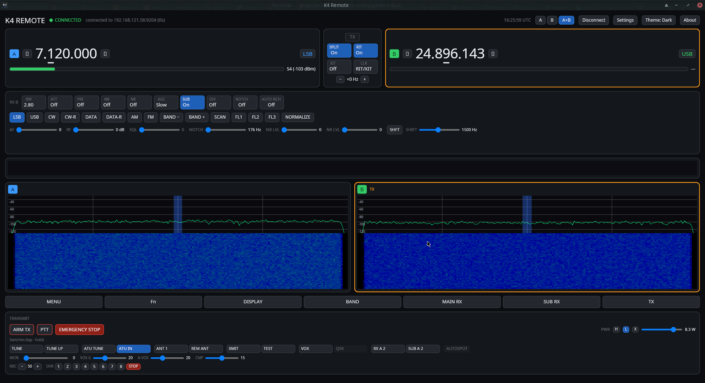
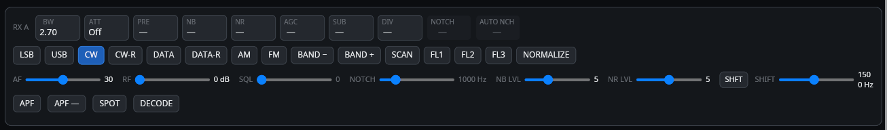
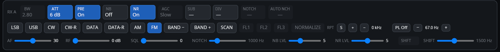
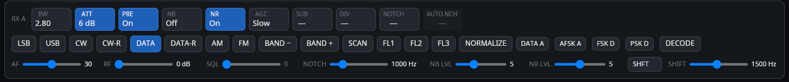

# K4 Remote — User Manual

A cross-platform remote-control panel for the **Elecraft K4** transceiver: rig control,
metering, spectrum + waterfall, full-duplex audio, and transmit (voice + CW), over Ethernet
or USB/serial. This manual walks through installing, connecting, and operating the app.

> **Screenshot placeholders.** Throughout this manual, boxes marked **📷 Screenshot needed**
> mark where an image should go, with a description of what to capture and the intended file
> name under [`docs/screenshots/`](screenshots/). Replace each with the actual image.

---

## Contents

1. [Installing & running](#1-installing--running)
2. [Connecting to your K4](#2-connecting-to-your-k4)
3. [The main window](#3-the-main-window)
4. [Tuning & VFOs](#4-tuning--vfos)
5. [Modes & the mode-adaptive UI](#5-modes--the-mode-adaptive-ui)
6. [Transmitting](#6-transmitting)
7. [Audio](#7-audio)
8. [The Elecraft K-Pod](#8-the-elecraft-k-pod)
9. [Diagnostics console](#9-diagnostics-console)
10. [Settings reference](#10-settings-reference)
11. [Keyboard shortcuts](#11-keyboard-shortcuts)
12. [Troubleshooting](#12-troubleshooting)
13. [Safety notes](#13-safety-notes)

---

## 1. Installing & running

### Prebuilt downloads

Tagged releases ship ready-to-run builds on the project's
[Releases page](https://github.com/dc0sk/K4remote/releases):

- **Windows** — `k4remote-windows-x86_64-setup.exe` (installer, with Start-menu shortcut and
  uninstaller) or the portable `k4remote-windows-x86_64.zip`.
- **Linux** — `.deb` (Debian / Ubuntu / Raspberry Pi OS, x86_64 + arm64) or a `.tar.gz` binary.
- **macOS** — `.tar.gz` binary.

To build from source instead, read on.

### Building from source

K4 Remote is built from source with **Rust 1.90 or newer**.

### System libraries

The default build needs a few native libraries:

| Platform | Install |
|---|---|
| **Debian / Ubuntu** | `sudo apt-get install -y libopus-dev libasound2-dev libssl-dev libudev-dev libsecret-1-dev libdbus-1-dev pkg-config` |
| **macOS** | `brew install opus pkg-config` (keychain + TLS use native frameworks) |
| **Windows** | Nothing extra — audio, keychain, and TLS use built-in APIs |

### Build & run

```sh
cargo run -p k4remote
```

The default feature set is `audio-device`, `tls`, `keychain`, `kpod` (serial/USB CAT is always
compiled in). For a minimal build without TLS, keychain, or K-Pod:

```sh
cargo run -p k4remote --no-default-features --features audio-device
```

> 📷 **Screenshot needed — `screenshots/app-launch.png`:** The app on first launch, before
> connecting (empty VFO readouts, the Settings button in the header).

---

## 2. Connecting to your K4

All connection settings live in the **Settings** dialog — open it from the **Settings** button
in the header.

> 📷 **Screenshot needed — `screenshots/settings-connection.png`:** The Settings dialog open at
> the **Connection** section, showing the host / port / TLS fields and the Saved peers list.

### Connection types

| Type | Port | Notes |
|---|---|---|
| **Ethernet (plaintext)** | 9205 | SHA-384 challenge/response authentication |
| **Ethernet (TLS-PSK)** | 9204 | Encrypted; uses your radio's pre-shared key |
| **USB / serial CAT** | — | Select the serial device; CAT only (no audio/spectrum over serial) |

1. Enter your K4's **host/IP** and **port**, and tick **TLS** for an encrypted link.
2. Enter the **password** (the K4's remote-access password). It is **never** written to the
   config file.
3. Optionally tick **Remember** to store the password in your **OS keychain** (Secret Service /
   Keychain / Credential Manager).
4. Click **Connect**.

Successful connections are added to **Saved peers** for one-click reconnect. The link
**auto-reconnects** with bounded backoff if it drops.

> 📷 **Screenshot needed — `screenshots/settings-peers.png`:** The Saved peers list with a couple
> of entries, each showing its **Use** / **Delete** buttons.

---

## 3. The main window



From top to bottom:

- **Header** — connection status, S-meter, view mode (A / B / A+B), theme, Settings, About.
- **VFO frames** — VFO A and VFO B frequency readouts with per-digit click tuning and an
  underline cursor marking the current tuning step.
- **Control row** — band, mode, bandwidth, filter edges, AGC, NB/NR, preamp, attenuator,
  RIT/XIT, split.
- **Panadapter** — live spectrum trace + scrolling waterfall + mini-pan (GPU-drawn), with
  click-to-QSY and mouse-wheel tuning.
- **Transmit panel** — the TX arm, PTT, and mode-specific transmit controls.

The **view mode** (A / B / A+B) picks which receiver(s) are shown; single-A or single-B also
selects the active RX, while A+B leaves that to a click in the spectrum pane.

---

## 4. Tuning & VFOs

### Click-to-tune digits

Click any digit of a VFO frequency to set the **tuning step** to that digit's place value
(1 Hz … 100 kHz). An **underline cursor** marks the active digit in both VFO frames, and this
step is kept in sync with the K4 (and the K-Pod encoder). Click the up/down halves of a digit
to step it.

> 📷 **Screenshot needed — `screenshots/vfo-digit-tune.png`:** Close-up of a VFO frame with the
> underline cursor under, say, the 100 Hz digit.

### RIT / XIT

**RIT** (receive incremental tuning) and **XIT** (transmit incremental tuning) apply a fine
offset of up to ±9.99 kHz without moving the VFO. Toggle them from the control row; clear the
offset with the RIT/XIT clear control. The offset stays in sync between the app, the K-Pod, and
the radio.

### Split & A/B

**Split** transmits on VFO B while receiving on VFO A. The transmit-VFO indicator follows the
radio's split state.

---

## 5. Modes & the mode-adaptive UI

The panel is **operating-mode aware** (on by default, switchable in Settings): controls the
current mode doesn't use are dimmed or tucked away, and a fixed-height **mode strip** surfaces
the ones it does — so each mode stays lean without the layout jumping around. Click the mode
label to cycle modes.

**CW** — an APF / SPOT / DECODE strip appears; the transmit panel shows keyer WPM, CW pitch,
and QSK delay:



**FM** — the passband/filter controls dim (FM's filters are fixed) and a repeater-offset +
PL/CTCSS strip takes their place:



**DATA** — a sub-mode selector (DATA A / AFSK A / FSK D / PSK D) plus text decode:



**SSB / AM** show the voice-oriented controls (passband, filter, and — on TX — VOX, compression,
mic gain).

---

## 6. Transmitting

> ⚠️ Transmit is deliberately gated. Read [Safety notes](#13-safety-notes) first.

1. **Arm TX** — transmit controls do nothing until you press **ARM TX**. This is a guard against
   accidental keying.
2. **PTT** — press the PTT button (or the keyboard hotkey) to transmit voice.
3. **CW** — key with the CW controls; keyer WPM, pitch, and QSK delay are in the transmit panel.
4. **Emergency stop** — immediately drops transmit and re-safes the radio.

If the link is lost while transmitting, a **fail-safe** returns the radio to receive.

### PTT keyboard hotkey

Set a **PTT hotkey** in Settings (default **Ctrl+Space**), in one of two modes:

- **Toggle** (default) — press once to start transmitting, again to stop.
- **Hold-to-talk** — transmit only while the key is held.

If you press the hotkey while TX is **not** armed, the **ARM TX** button flashes to remind you to
arm first.

> 📷 **Screenshot needed — `screenshots/transmit-armed.png`:** The transmit panel with TX armed
> and the PTT / emergency-stop controls visible.

---

## 7. Audio

Full-duplex **12 kHz Opus** audio streams over the Ethernet link (left = Main RX, right = Sub RX).

In **Settings → Audio**:

- **Speaker** — choose the RX playback (output) device.
- **Mic** — choose the TX capture (input) device.
- **Volume** and **Mic gain** — local level controls.
- **Mute radio monitor on connect** — silences the radio's local TX monitor so a remote session
  doesn't blare the shack speaker (on by default).

> 📷 **Screenshot needed — `screenshots/settings-audio.png`:** The Settings **Audio** section with
> the Speaker / Mic dropdowns and the Volume / Mic-gain sliders.

---

## 8. The Elecraft K-Pod

The optional **Elecraft K-Pod** USB control surface gives you a real tuning knob, a rocker, and
eight function switches. Plug it into the **computer** running K4 Remote (not the K4).

> 📷 **Screenshot needed — `screenshots/kpod-device.png`:** The physical K-Pod, ideally with the
> rocker and F1–F8 switches labelled.

### Enabling it

K-Pod support is **off by default**. In **Settings**, turn **K-Pod: ON**. The app searches for
the device and keeps working whether or not one is attached (it retries discovery and survives
unplug/replug).

### Rocker & knob

The **rocker** selects what the knob tunes, with an indicator LED:

| Rocker | Knob tunes | LED |
|---|---|---|
| Left | VFO A | D1 |
| Center | VFO B | D2 |
| Right | RIT / XIT offset | D3 |

Selecting VFO A or B also switches the K4's **transmit VFO** (via split), which the app reflects.
The encoder tunes at the **current per-digit step** (the one shown by the underline cursor);
RIT/XIT tunes at a finer step so it doesn't slam to the ±9.99 kHz limit.

### Function switches (F1–F8)

Each of the eight switches has a **tap** and a **hold** action — **16 slots** in all. Each slot
runs a **CAT macro**: a string of K4 commands sent to the radio when you press the switch. This
mirrors how the K-Pod's macros work on a standalone K4, but the app holds the table (the K4
exposes no way to read or write its stored macros remotely).

Configure them in **Settings → K-Pod function switches**:

- Each row is one slot (**F1 tap**, **F1 hold**, … **F8 hold**).
- Pick a **preset** from the list (shown as `label — description`) to fill the slot, **or** type
  a **free-form CAT string** (e.g. `MD3;BW0040;`) directly.
- The **label tag** names the current assignment at a glance (blank for a hand-typed macro).
- **Reset to samples** re-seeds all 16 slots from the Elecraft Owner's-Manual sample macros.

Assignments are saved automatically and take effect on the next press.

> 📷 **Screenshot needed — `screenshots/kpod-editor.png`:** Settings scrolled to **K-Pod function
> switches**, showing several slots with preset labels and CAT strings, and the **Reset to
> samples** button.

> **CAT macros can do anything a K4 command can — including keying the transmitter.** See
> [Safety notes](#13-safety-notes).

---

## 9. Diagnostics console

Enable **Show diagnostics window** in Settings to open a separate **Diagnostics** window for
troubleshooting.

- **LOG** — show/hide the live CAT + event log.
- **AUTOSCROLL** — when on, the log follows the newest line. Turn it **off** to **freeze** the
  current lines so the fast-scrolling traffic holds still to be read.
- **Filter** — type any text to show only log lines containing it (case-insensitive) — e.g. type
  `RO` to watch just RIT/XIT traffic, or `kpod` for K-Pod events.
- **COPY** — copy the currently-visible (filtered) lines to the clipboard, to paste elsewhere.
- **Selecting text** — the log is a read-only text area: drag to select and press **Ctrl+C** to copy
  just the selection. Turn **AUTOSCROLL off** first so the buffer holds still while you select.
- **Raw CAT** — type a command (e.g. `IF;`) and **Send** to issue it directly and see the reply.

The log keeps several thousand recent lines; the header shows how many are currently visible.

> 📷 **Screenshot needed — `screenshots/diagnostics.png`:** The Diagnostics window with the log
> visible, the filter box containing a term, and the raw-CAT input.

---

## 10. Settings reference

Open **Settings** from the header; press **ESC** (or **Close**) to dismiss it.

| Section | What it holds |
|---|---|
| **Connection** | Host, port, TLS, password, Remember, Connect/Disconnect |
| **Saved peers** | Reconnect to / delete stored peers |
| **Peer-password storage** | OS-keychain master controls |
| **Audio** | Speaker/Mic device selection, Volume, Mic gain, mute-radio-monitor, mode-adaptive UI toggle, K-Pod on/off |
| **K4 settings backup** | Export the radio's settings to a SHA-256-stamped `.cfg`, and import one back |
| **K-Pod function switches** | The 16-slot F1–F8 tap/hold macro editor |

The **theme** (dark / light / high-contrast / follow-system) cycles from the header.

> 📷 **Screenshot needed — `screenshots/settings-backup.png`:** The **K4 settings backup** section
> with the Export / Import controls.

---

## 11. Keyboard shortcuts

| Key | Action |
|---|---|
| **PTT hotkey** (default `Ctrl+Space`) | Transmit — toggle or hold-to-talk (configurable) |
| **ESC** | Close the Settings or About dialog / cancel hotkey capture |

---

## 12. Troubleshooting

**The K-Pod isn't detected.**
Make sure **K-Pod: ON** in Settings and that the device is plugged into the computer. On Linux you
may need udev permission for the HID device (VID `0x04D8` / PID `0xF12D`). Watch the Diagnostics
console (filter `kpod`) for connect/disconnect messages.

**No audio.**
Check **Settings → Audio** device selection, the **Volume** slider, and that the link is an
Ethernet connection (serial carries CAT only). Confirm the OS isn't routing playback elsewhere.

**RIT/XIT seems out of sync.**
The offset syncs between app, K-Pod, and radio. Use the Diagnostics filter (`RO` / `RT` / `XT`)
to watch the traffic; ensure RIT or XIT is actually **on** (a stored offset with both off shifts
nothing).

**Can't connect.**
Verify host/port and TLS match the radio's remote settings, and that the password is correct.
Plaintext is 9205, TLS-PSK is 9204.

---

## 13. Safety notes

- **Transmit is armed manually.** Nothing keys the radio until you press **ARM TX**; use it
  deliberately and keep an eye on power/SWR.
- **K-Pod macros can transmit.** A function-switch macro is arbitrary CAT — if it contains a
  transmit command, pressing that switch will key the radio, bypassing the on-screen TX arm. Only
  assign transmit commands to switches you intend to key with.
- **Emergency stop** immediately drops transmit and re-safes the radio.
- The remote link has a **fail-safe**: losing the connection while transmitting returns the radio
  to receive.
